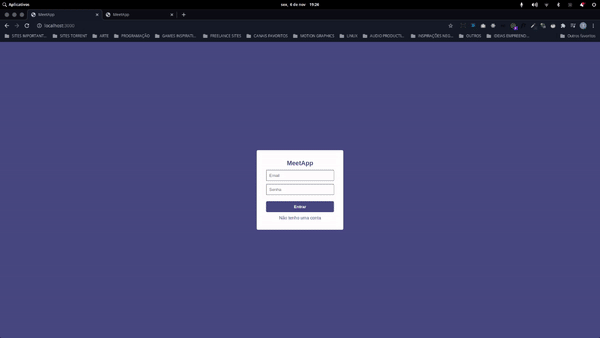
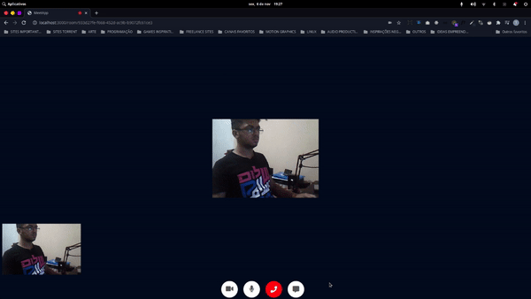

<h1 align="center">
  MeetApp
</h1>

  
  
  

  

  

  
  
  

  <a href="#-project">Project</a>&nbsp;&nbsp;&nbsp;|&nbsp;&nbsp;&nbsp;
  <a href="#technology">Technology</a>&nbsp;&nbsp;&nbsp;|&nbsp;&nbsp;&nbsp; 
  <a href="#arrow_forward-how-to-run">How to run</a>&nbsp;&nbsp;&nbsp;|&nbsp;&nbsp;&nbsp; 

 

## 💻 Project

MeetApp is a video conference made with NodeJS. 

# Features

On MeetApp you can create rooms, also you can copy the room ID and share with people that you want in your room. 

 

Also you have a chat where you can send messages to your friends. 

 

## Technology

This project was developed with the following technologies:

- [Node.js](https://nodejs.org/en/)
- [PeerJS](https://peerjs.com/)
- [WebRTC](https://webrtc.org/)
- [SocketIO](https://socket.io/)

## :arrow_forward: How to run

- In your terminal run `yarn or npm` to install dependencies
- Run `yarn dev or npx dev` to start the server then run `yarn peer or npx peer` to start peer server.

If all goes well, the backend of application will be available at: **http://localhost:3000**

---

Made By ♥ [Elian Campos](https://github.com/lyandeveloper). Add me on [LinkedIn](https://www.linkedin.com/in/elian-campos/) :wave:
